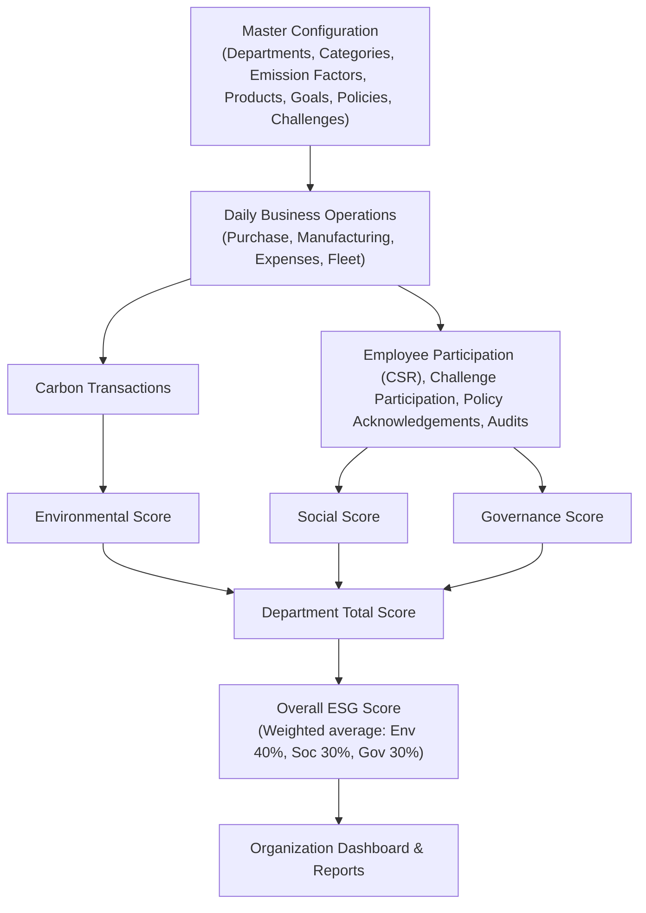

# EcoSphere: ESG Management Platform

EcoSphere is an ESG Management Platform that enables organizations to measure, manage, and improve their Environmental, Social, and Governance performance. It integrates operational data, employee participation, and compliance activities into a unified dashboard while encouraging sustainability through gamification.

## Challenge Statement

While many ERP systems collect operational data, ESG reporting is often manual, disconnected, and difficult to monitor in real time. EcoSphere aims to integrate ESG directly into day-to-day ERP operations by measuring sustainability metrics, encouraging employee participation, and providing meaningful reports for management.

## Core Modules

- **Environmental**: Carbon accounting, emission factors, sustainability goals, and carbon reports.
- **Social**: CSR activities, employee participation, diversity metrics, and engagement.
- **Governance**: Policies, audits, compliance tracking, and governance reports.
- **Gamification**: Challenges, badges, XP, rewards, and leaderboards.

## Data Model Overview

### Master Data
- **Department**: Organizational hierarchy and ESG ownership.
- **Category**: Shared category values used across Social and Gamification modules.
- **Emission Factor**: Carbon values used during calculations.
- **Product ESG Profile**: ESG information linked to products.
- **Environmental Goal**: Sustainability targets.
- **ESG Policy**: Governance policies.
- **Badge**: Employee achievements.
- **Reward**: Redeemable incentives.

### Transactional Data
- **Carbon Transaction**: Stores calculated emissions from ERP operations.
- **CSR Activity**: Social initiatives organized by the company.
- **Employee Participation**: Tracks employee involvement in CSR Activities.
- **Challenge**: Sustainability challenges.
- **Challenge Participation**: Tracks employee progress within Challenges.
- **Policy Acknowledgement**: Employee policy acceptance.
- **Audit**: Governance audits.
- **Compliance Issue**: Governance violations.
- **Department Score**: Aggregated ESG performance per department.

## Business Workflow

1. **Master Configuration**: Departments, Categories, Emission Factors, Products, Goals, Policies, Challenges.
2. **Daily Business Operations**: Purchase, Manufacturing, Expenses, Fleet.
3. **Transactions**: Carbon Transactions, Employee Participation (CSR), Challenge Participation, Policy Acknowledgements, Audits.
4. **Scoring**: Environmental Score, Social Score, Governance Score -> Department Total Score.
5. **Overall ESG Score**: Weighted average of Department Total Scores (default weighting: Environmental 40% / Social 30% / Governance 30%, configurable).
6. **Organization Dashboard & Reports**

## Expected Features

- **Environmental**: Configure Emission Factors, Calculate Carbon Emissions, Department Carbon Tracking, Sustainability Goals, Environmental Dashboard.
- **Social**: CSR Activities, Employee Participation, Diversity Metrics, Training Completion.
- **Governance**: ESG Policies, Policy Acknowledgements, Audits, Compliance Issues.
- **Gamification**: Challenges (lifecycle: Draft, Active, Under Review, Completed, Archived), XP, Badges, Rewards, Leaderboards.
- **Settings & Administration**: Departments management, Category management, ESG Configuration, Notification Settings.

## Reports

The platform generates the following reports, exportable to PDF, Excel, or CSV:
- Environmental Report
- Social Report
- Governance Report
- ESG Summary Report
- Custom Report Builder (Supports filtering by Department, Date Range, Module, Employee, Challenge, ESG Category).

## Core Configuration & Business Rules

- **Reward Redemption**: Employees can redeem earned Points/XP for a Reward from the catalog, subject to stock availability.
- **Notification System**: The platform sends notifications (in-app and/or email) for new compliance issues, CSR/Challenge approval decisions, policy acknowledgement reminders, and badge unlocks.
- **Auto Emission Calculation**: Carbon Transactions are calculated automatically from linked ERP records using the relevant Emission Factor.
- **Evidence Requirement**: CSR Activity participation cannot be marked Approved without an attached proof file.
- **Badge Auto-Award**: A Badge is automatically assigned to an employee when their metrics satisfy the Badge's Unlock Rule.
- **Compliance Issue Ownership**: Every Compliance Issue must have an assigned Owner and a Due Date. Overdue issues are flagged.

## Visual Mockup

[View Excalidraw Mockup](https://link.excalidraw.com/l/65VNwvy7c4X/2m6lz9Ln4)
